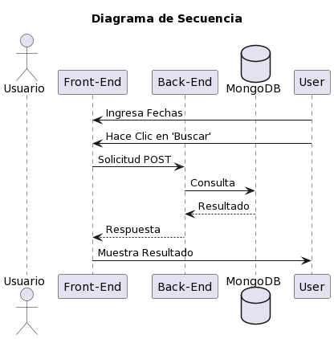
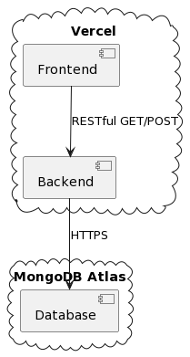

# Minicore Sample

Este es un proyecto de ejemplo que consta de una aplicación web front-end y una API de back-end que interactúa con una base de datos MongoDB para buscar el producto más vendido en un rango de fechas.

## Tecnologías Utilizadas

-   Front-End: React
-   Back-End: Node.js con Express
-   Base de Datos: MongoDB Atlas
-   Otras dependencias: Axios, Mongoose, Body-Parser, Cors

## Configuración

Antes de ejecutar la aplicación, asegúrate de configurar adecuadamente las siguientes partes:

### Front-End

1. Ve al directorio `/frontend`.
2. Ejecuta `npm install` para instalar las dependencias.
3. Abre el archivo `src/buscador.js` y asegúrate de que la URL de la API coincide con la URL de tu servidor de back-end.

### Back-End

1. Ve al directorio `/backend`.
2. Ejecuta `npm install` para instalar las dependencias.
3. En el archivo `index.js`, asegúrate de que la conexión a la base de datos MongoDB está configurada correctamente.

## Ejecución

Para ejecutar la aplicación, sigue estos pasos:

### Front-End

1. Ve al directorio `/frontend`.
2. Ejecuta `npm start` para iniciar el servidor de desarrollo de React.

### Back-End

1. Ve al directorio `/backend`.
2. Ejecuta `npm start` para iniciar el servidor de Node.js.

## Diagrama de secuencia

El diagrama muestra la unica funcionalidad implementada en el proyecto.

## Diagrama de Despliegue

El despliegue fue hecho en vercel por lo que no se tiene certeza ni datos exactos de como esta desplegada la aplicacion.
